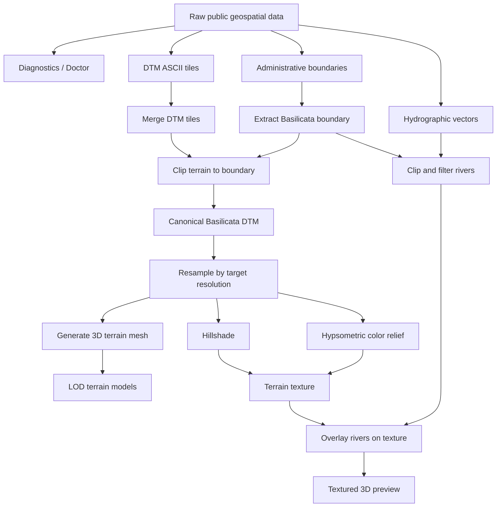

# B3DO — Basilicata 3D Open

**Type:** Geospatial processing pipeline  
**Role:** Project Lead · Software Architect · Data Pipeline Engineer  
**Status:** Unpublished / in active development  
**Domain:** Geospatial data, terrain modeling, 3D model generation, open data  
**Stack:** Python, GDAL, Rasterio, NumPy, PyVista, Fiona, Typer  

---

## Overview

B3DO is a geospatial processing pipeline designed to transform public terrain datasets of the Basilicata region into 3D terrain models.

The project is not a web application. Its architectural value is in the reproducible data-to-model workflow: raw digital terrain model tiles and vector datasets are validated, merged, clipped to regional boundaries, resampled into multiple levels of detail, converted into 3D meshes, and enriched with terrain textures and hydrographic overlays.

The goal is to create an open, inspectable pipeline for building 3D representations of Basilicata from public geospatial data.

---

## Problem Space

Public geospatial datasets are often available as specialized source formats rather than as ready-to-use 3D assets.

Turning them into usable terrain models requires several coordinated steps:

- validating local system dependencies and source datasets
- merging multiple DTM tiles into a canonical raster
- extracting the regional boundary from administrative vector data
- clipping terrain data to the target geographic area
- resampling the terrain into practical model resolutions
- generating 3D meshes from elevation rasters
- producing terrain textures using hillshade and color relief
- overlaying hydrographic information such as rivers

B3DO treats these steps as an explicit pipeline rather than a one-off manual GIS workflow.

---

## Pipeline Architecture

---

## Core Workflow

B3DO exposes the pipeline through a CLI built with Typer.

The workflow includes:

- `doctor` to validate GDAL tools, input folders, DTM tiles, boundaries, and optional river datasets
- `merge` to combine raw DTM ASCII tiles into a GeoTIFF
- `boundary` to extract the Basilicata regional boundary from source shapefiles
- `clip` to produce the canonical clipped terrain raster
- `resample` to create target-resolution rasters
- `mesh` and `build` to generate terrain meshes and LOD outputs
- `colorize` to produce hillshade and hypsometric color relief rasters
- `texture` and `texture-rivers` to build terrain textures and overlay rivers
- `view-complete` to inspect a textured 3D scene

This structure makes the pipeline repeatable, diagnosable, and suitable for incremental improvement.

---

## Data and Model Boundaries

The project separates raw data, processed data, build artifacts, and final model outputs.

Key boundaries include:

- raw DTM tiles and vector datasets
- processed canonical rasters and clipped vectors
- generated raster products such as hillshade, color relief, and textures
- preview models and LOD terrain meshes
- web, print, and model-output directories

This separation keeps the pipeline clear: source data remains distinct from derived artifacts, and each stage can be re-run without confusing inputs with outputs.

---

## 3D Terrain Generation

The mesh generation layer converts elevation rasters into 3D terrain surfaces.

Rasterio reads the elevation model and transform metadata, NumPy constructs coordinate grids and elevation arrays, and PyVista builds a structured grid that can be exported as a surface mesh.

The pipeline also supports vertical exaggeration, which is useful when inspecting regional terrain features and producing visually readable previews.

---

## Texture and Hydrography

B3DO does not stop at bare elevation meshes.

The pipeline can generate terrain textures by combining:

- hillshade rasters
- hypsometric color relief
- river vectors clipped to the Basilicata boundary

The result is a more informative terrain representation where elevation, relief, and hydrographic structure can be inspected together.

---

## Why This Project Matters

B3DO expands my portfolio beyond backend and cloud systems into geospatial processing and computational model generation.

It demonstrates the same architectural principles applied to a different domain:

- explicit processing boundaries
- reproducible CLI workflows
- validation before execution
- separation between raw inputs and generated artifacts
- modular pipeline stages
- long-term maintainability over manual one-off processing

This is valuable because software architecture is not limited to web services. The same thinking applies when transforming complex data into reliable, reusable technical outputs.

---

## Current Scope and Disclosure

B3DO is currently unpublished and should be read as an active pipeline project rather than a released public product.

The case study intentionally focuses on the architecture and workflow of the processing system, without presenting it as a completed public dataset or production service.

---

## What This Case Study Demonstrates

This project demonstrates experience in:

- geospatial data processing
- reproducible data pipelines
- CLI-driven engineering workflows
- terrain model generation
- raster and vector processing
- 3D mesh generation
- separation of source data and derived artifacts
- applying architectural thinking outside traditional backend systems
