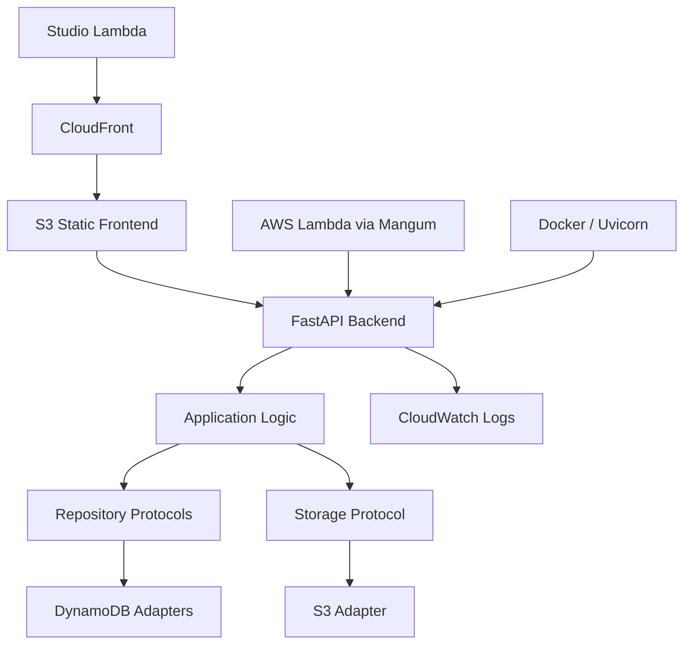

# Cloud-Portable Fleet Management Platform

- **Tipo:** applicazione fleet management in produzione
- **Utilizzo reale:** in uso presso Studio Lambda
- **Processo supportato:** gestione del turnover dei veicoli di 50 dipendenti
- **Ruolo:** Software Architect · Backend Engineer · Cloud Deployment
- **Periodo:** 2026
- **Deployment effettivo:** AWS

---

## Sintesi

- **Contesto:** Studio Lambda aveva bisogno di uno strumento operativo per gestire il turnover dei veicoli assegnati a 50 dipendenti.
- **Mio ruolo:** ho progettato e realizzato la piattaforma applicativa, con backend FastAPI, frontend React/TypeScript e deployment AWS.
- **Problema:** il sistema doveva supportare veicoli, prenotazioni, viaggi, rifornimenti, manutenzioni, documenti, statistiche e report senza legare la logica applicativa a una singola tecnologia infrastrutturale.
- **Intervento:** ho separato logica applicativa, persistenza, storage, configurazione runtime e modalità di esposizione HTTP attraverso interfacce, adapter e configurazioni esplicite.
- **Risultato osservato:** il Fleet Management System è in uso presso Studio Lambda per il processo di turnover dei veicoli di 50 dipendenti ed è deployato su AWS.

Questo dato non indica 50 utenti attivi, 50 utenti simultanei o 50 veicoli: indica il processo operativo supportato, cioè il turnover dei veicoli di 50 dipendenti.

---

## Utilizzo in Produzione

Il sistema è utilizzato da Studio Lambda come piattaforma fleet management interna.

Il processo supportato è la gestione del turnover dei veicoli di 50 dipendenti: assegnazioni, disponibilità, prenotazioni, viaggi, rifornimenti, manutenzioni, documenti e reporting operativo.

Il deployment effettivo è su AWS. Non dichiaro deployment su altri cloud provider, migrazioni già collaudate o compatibilità universale: l’indipendenza infrastrutturale descritta sotto è una proprietà progettuale del codice e dell’architettura.

---

## Architettura

La piattaforma è composta da frontend React/TypeScript, backend FastAPI, livelli di persistenza e storage separati dalla logica applicativa, e deployment AWS basato su servizi gestiti.

---

## Mio Ruolo e Contributi

Nel progetto ho lavorato su progettazione, implementazione e deployment:

- modellazione delle principali entità operative: utenti, veicoli, prenotazioni, viaggi, rifornimenti, manutenzioni, documenti, statistiche e report;
- backend FastAPI con router, servizi applicativi, schemi Pydantic e autenticazione JWT;
- separazione della persistenza tramite repository basati su `Protocol`;
- adapter DynamoDB per utenti, veicoli, viaggi, prenotazioni, rifornimenti, manutenzioni e commesse;
- storage documentale per ricevute tramite interfaccia dedicata e adapter S3;
- ambiente locale con Docker Compose, DynamoDB Local e MinIO;
- deployment AWS con Lambda, ECR, DynamoDB, S3, CloudFront, CloudFormation e CloudWatch;
- automazioni Bash per deploy, seed amministrativo e consultazione log.

---

## Indipendenza Infrastrutturale

La portabilità progettuale riguarda tre dimensioni distinte.

### Database

La logica applicativa dipende da contratti repository, non direttamente da DynamoDB. Nel codice questi contratti sono espressi con `Protocol`, ad esempio per utenti, veicoli, viaggi, prenotazioni, rifornimenti, manutenzioni, commesse e transazioni applicative.

Le classi `DynamoDb...Repository` implementano quei contratti come adapter infrastrutturali. La configurazione delle tabelle è separata in `DynamoDbConfig` e caricata da variabili d’ambiente come `USERS_TABLE_NAME`, `TRIPS_TABLE_NAME`, `CARS_TABLE_NAME`, `DYNAMODB_ENDPOINT_URL` e `AWS_REGION`.

Questo rende la dipendenza da DynamoDB concentrata negli adapter. Non significa che cambiare database sia automatico: sarebbero necessari nuovi adapter, mappature, migrazioni dati e verifiche.

### Cloud

AWS è l’ambiente reale di deployment. La separazione cloud consiste nel tenere i servizi provider-specifici fuori dalla logica di dominio e applicativa.

Il backend usa configurazioni per DynamoDB e S3, mentre in locale usa DynamoDB Local e MinIO tramite endpoint configurabili. Lo storage ricevute passa da un contratto `ReceiptPhotoStorage` e dall’adapter `S3ReceiptPhotoStorage`.

Questa impostazione riduce il lock-in applicativo, ma non equivale a dichiarare deployment già validati su altri provider. Un cambio cloud richiederebbe adapter, configurazioni, infrastruttura equivalente, test e migrazioni.

### Web Server

La logica applicativa è esposta come applicazione FastAPI/ASGI. In locale o container può essere eseguita con Uvicorn; su AWS viene adattata a Lambda tramite Mangum.

Questa separazione tiene il codice applicativo distinto dalla scelta del server o runtime che lo espone. Anche qui non è una promessa di sostituzione senza interventi: ogni runtime richiede configurazione, packaging, osservabilità e verifiche proprie.

---

## Deployment AWS

Il deployment effettivo usa:

- backend FastAPI pacchettizzato come immagine container;
- immagine pubblicata su Amazon ECR;
- AWS Lambda come runtime backend tramite Mangum;
- DynamoDB per la persistenza applicativa;
- S3 per frontend statico, documenti e ricevute;
- CloudFront per la distribuzione del frontend;
- CloudFormation per Infrastructure as Code;
- CloudWatch per log applicativi e osservabilità.

---

## Cosa Dimostra

Questo progetto dimostra la capacità di trasformare un’esigenza operativa reale in una piattaforma in produzione:

- comprensione del processo supportato presso Studio Lambda;
- progettazione e sviluppo diretto di backend, API e deployment;
- separazione fra logica applicativa e scelte infrastrutturali;
- uso di AWS come ambiente di produzione senza far entrare i servizi cloud nel dominio;
- attenzione a configurazione, ambiente locale, deploy e manutenzione.

Questo progetto è distinto dal caso [Backend Telemetria Fleet Real-Time](../fleet-tracking/index.md), relativo all’infrastruttura per 80 tracker realizzata in Vemar.
