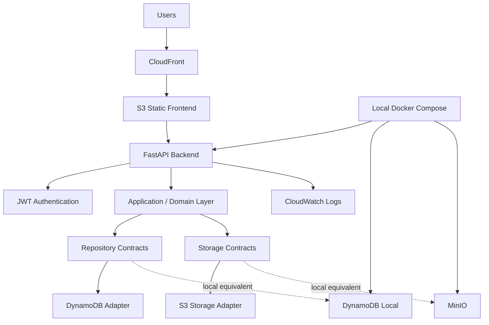
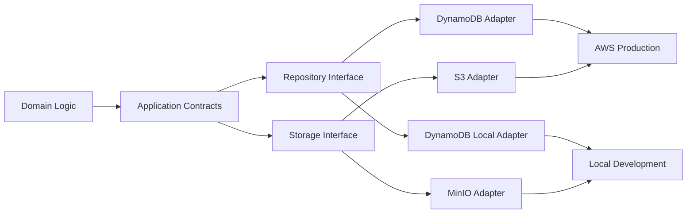

# Cloud-Portable Fleet Management Platform

**Type:** Production-adopted cloud application
**Role:** Software Architect · Backend Engineer · Cloud Deployment
**Period:** 2026
**Domain:** Fleet management, backend systems, AWS, cloud-portable architecture
**Status:** Adopted in production in a real business context

---

## Overview

This case study describes a full-stack fleet management platform for company vehicle operations.

The platform supports users, vehicles, reservations, trips, refueling, maintenance, documents, statistics, and reports. It was developed as a complete application and later adopted in production in a real business context, serving an internal user base of approximately 50 employees.

The most important architectural choice was to keep the business logic separate from the cloud services used in production. AWS is the production target, but the application is not designed as a set of AWS-specific workflows.

Instead, the backend uses explicit repository, storage, runtime, and deployment boundaries. That makes the same system easier to run locally, deploy on AWS, and adapt later if the infrastructure changes.

---

## Problem Space

Fleet management systems often grow from immediate operational needs: a reservation feature here, a maintenance workflow there, then refueling, documents, reporting, and user management.

If those pieces are added without a clear structure, the system can become difficult to change:

- business logic becomes tightly coupled to storage choices
- deployment environments drift between local development and production
- cloud services leak into the domain model
- operational visibility is added only after deployment
- changes to infrastructure require changes to application logic

The goal was to build a real operational tool while keeping the architecture understandable and maintainable.

---

## Architecture Overview

The platform is structured around a React frontend, a FastAPI backend, abstracted persistence and storage layers, and an AWS deployment model based on serverless and managed services.

At a high level:

---

## Data Model

The application model covers the main operational entities of a fleet management system: users, vehicles, reservations, trips, refueling events, maintenance records, commits, files, and reporting-related data.

The important design choice is that these entities are modeled at the application level first. Persistence is handled behind repository interfaces, so the domain model is not forced to look like DynamoDB tables or S3 objects.

This model was imported from the backend project diagrams and added here to make the case study easier to understand from the domain side, not only from the infrastructure side.

---

## Cloud Portability by Design

The platform was designed to avoid coupling business logic directly to a specific cloud provider.

The backend exposes application-level repository and storage contracts. Infrastructure-specific implementations handle DynamoDB and S3 in production, while local development uses DynamoDB Local and MinIO.

This allowed the same application architecture to run across:

- local development environments using Docker Compose
- AWS production deployment using Lambda, ECR, DynamoDB, S3, CloudFront, CloudFormation, and CloudWatch
- future alternative deployment targets with limited infrastructure adapter changes

The result is a cloud-portable system with AWS as the production target.

---

## Backend Design

The backend was implemented with FastAPI and organized around explicit application boundaries.

Key backend characteristics include:

- domain models for users, cars, trips, reservations, refueling, maintenance, and commits
- Pydantic schemas for validation and API contracts
- JWT-based authentication
- password hashing with Argon2
- repository interfaces based on Python `Protocol`
- application transaction abstractions
- structured routers for user, car, trip, reservation, maintenance, refueling, statistics, and reports
- export workflows for Excel reports
- PDF report generation for trip-related documents
- structured HTTP request logging

This design kept the domain and application layers independent from the AWS runtime and from the specific persistence implementation.

---

## Infrastructure Abstraction

The persistence and storage layers were deliberately abstracted.

DynamoDB is treated as an infrastructure adapter, not as the domain model.
S3 is treated as an object storage implementation, not as an application dependency.

Local development uses cloud-compatible substitutes:

- DynamoDB Local for table-oriented persistence
- MinIO for S3-compatible object storage
- Docker Compose to reproduce the production topology without requiring live AWS resources

This made the development environment faster to use, safer to experiment with, and closer to production behavior.

---

## AWS Deployment

The production deployment was implemented using AWS managed services and Infrastructure as Code.

Backend deployment:

- FastAPI application packaged as a container image
- image published to Amazon ECR
- AWS Lambda running the backend through Mangum
- Lambda Function URL as the HTTPS entry point
- DynamoDB tables for application persistence
- S3 bucket for document and receipt storage
- IAM role with scoped access to the required tables and bucket
- CloudWatch Logs for backend observability

Frontend deployment:

- React / TypeScript / Vite static build
- private S3 bucket for frontend assets
- CloudFront distribution with Origin Access Control
- HTTPS delivery using the default CloudFront domain
- CloudFront access logs stored in a dedicated S3 bucket
- SPA fallback handling for client-side routing

Deployment automation:

- CloudFormation templates for backend and frontend resources
- Bash scripts for backend deployment, frontend deployment, full deployment, admin seeding, and log inspection
- configurable environment variables for region, profile, JWT secret, CORS origins, logging, and retention

---

## Observability & Operations

The platform includes operational visibility at multiple levels.

Backend logs are collected in CloudWatch.
Frontend browser-side errors can be sent to a hidden backend endpoint and written to the same CloudWatch log group.
CloudFront access logs are stored in S3 with retention management.

This produced three complementary observability layers:

1. backend application logs
2. browser-side frontend error logs
3. HTTP access logs from the static frontend distribution

The design made production troubleshooting part of the deployment model rather than a later addition.

---

## Security and Runtime Controls

The platform includes several security-oriented decisions:

- JWT-based authentication
- Argon2 password hashing
- production API documentation disabled
- CORS configured through deployment variables
- private S3 bucket for frontend hosting behind CloudFront
- private S3 bucket for receipts/documents
- IAM permissions scoped to the required DynamoDB tables and S3 resources
- hidden frontend client-log endpoint excluded from public API documentation
- HTTPS delivery through AWS managed endpoints

The focus was not only to deploy the application, but to deploy it with explicit runtime and operational boundaries.

---

## Production Adoption

The platform moved beyond a training exercise and was adopted in production in a real business context.

This is the most relevant outcome of the project: the system was considered useful and stable enough to support internal operational workflows, with an estimated user base of approximately 50 employees.

For portfolio purposes, the business context is intentionally described without exposing company-specific implementation details, internal URLs, or proprietary operational data.

---

## My Role

I designed and implemented the system end-to-end, covering application architecture, backend development, cloud deployment, infrastructure automation, and part of the frontend integration.

My work included defining the backend domain structure, the data model, repository and storage abstractions, AWS deployment model, local Docker Compose environment, CloudFormation templates, deployment scripts, logging strategy, and production-oriented runtime configuration.

This project strengthened the connection between my previous work on modular backend systems and my current focus on cloud-portable architectures: systems where infrastructure abstraction, containerized runtime boundaries, and operational reliability are part of the architecture from the beginning.

---

## What This Case Study Demonstrates

This project demonstrates experience in:

- cloud-portable application architecture
- AWS serverless deployment
- backend architecture with FastAPI
- infrastructure abstraction
- Docker Compose-based local environments
- CloudFormation-based Infrastructure as Code
- production-oriented observability
- frontend/backend integration
- operational delivery of a real business application

---

## Read Next

- [Back to case studies](../index.md)
- [Technical profile](../../profile.md)
- [CV](../../cv.md)
- [Contact](../../contact.md)
- [IoT Data Aggregation Architecture](../iot-data-aggregation-digital-twin/index.md)
