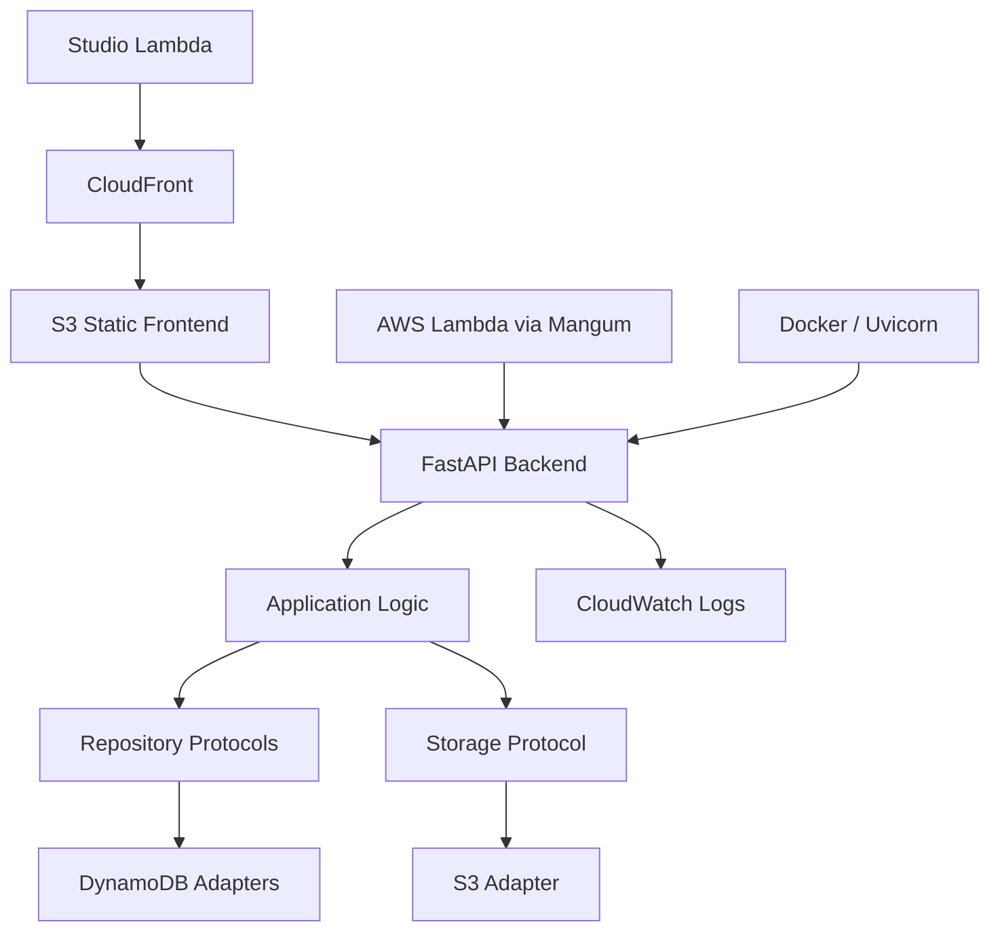

# Cloud-Portable Fleet Management Platform

- **Type:** production fleet management application
- **Real use:** used by Studio Lambda
- **Supported process:** vehicle turnover management for 50 employees
- **Role:** Software Architect · Backend Engineer · Cloud Deployment
- **Period:** 2026
- **Actual deployment:** AWS

---

## Summary

- **Context:** Studio Lambda needed an operational tool to manage vehicle turnover for 50 employees.
- **My role:** I designed and implemented the application platform, including the FastAPI backend, React/TypeScript frontend integration, and AWS deployment.
- **Problem:** the system had to support vehicles, reservations, trips, refueling, maintenance, documents, statistics, and reports without binding application logic to one infrastructure technology.
- **Intervention:** I separated application logic, persistence, storage, runtime configuration, and HTTP exposure through explicit interfaces, adapters, and configuration.
- **Observed result:** the Fleet Management System is used by Studio Lambda for vehicle turnover management for 50 employees and is deployed on AWS.

This does not mean 50 active users, 50 concurrent users, or 50 vehicles. It describes the supported operational process: vehicle turnover for 50 employees.

---

## Production Use

The system is used by Studio Lambda as an internal fleet management platform.

The supported process is vehicle turnover management for 50 employees: assignments, availability, reservations, trips, refueling, maintenance, documents, and operational reporting.

The actual deployment environment is AWS. I do not claim deployment on other cloud providers, validated migrations, or universal compatibility. The infrastructure independence described below is a design property of the code and architecture.

---

## Architecture

The platform combines a React/TypeScript frontend, a FastAPI backend, persistence and storage layers separated from application logic, and an AWS deployment model based on managed services.

---

## My Role and Contributions

My work covered design, implementation, and deployment:

- modeled the main operational entities: users, vehicles, reservations, trips, refueling, maintenance, documents, statistics, and reports;
- built the FastAPI backend with routers, application services, Pydantic schemas, and JWT authentication;
- separated persistence behind repository contracts based on Python `Protocol`;
- implemented DynamoDB adapters for users, vehicles, trips, reservations, refueling, maintenance, and commits;
- implemented receipt/document storage through a dedicated storage interface and S3 adapter;
- configured local development with Docker Compose, DynamoDB Local, and MinIO;
- deployed the system on AWS with Lambda, ECR, DynamoDB, S3, CloudFront, CloudFormation, and CloudWatch;
- created Bash automation for deployment, admin seeding, and log inspection.

---

## Infrastructure Independence

The design portability concerns three distinct dimensions.

### Database

Application logic depends on repository contracts, not directly on DynamoDB. In the codebase, these contracts are expressed with Python `Protocol` types for users, vehicles, trips, reservations, refueling, maintenance, commits, and application transactions.

The `DynamoDb...Repository` classes implement those contracts as infrastructure adapters. Table configuration is separated into `DynamoDbConfig` and loaded from environment variables such as `USERS_TABLE_NAME`, `TRIPS_TABLE_NAME`, `CARS_TABLE_NAME`, `DYNAMODB_ENDPOINT_URL`, and `AWS_REGION`.

This concentrates DynamoDB-specific code in adapters. It does not mean that changing database requires no work: new adapters, mappings, data migrations, and verification would still be needed.

### Cloud

AWS is the real deployment environment. Cloud separation means keeping provider-specific services outside the domain and application logic.

The backend uses configurable DynamoDB and S3 clients, while local development uses DynamoDB Local and MinIO through configurable endpoints. Receipt storage is accessed through a `ReceiptPhotoStorage` contract and implemented by `S3ReceiptPhotoStorage`.

This reduces application-level lock-in, but it is not a claim that other cloud providers have already been deployed or validated. A cloud change would require adapters, configuration, equivalent infrastructure, tests, and migrations.

### Web Server

The application logic is exposed as a FastAPI/ASGI application. Locally or in a container it can run through Uvicorn; on AWS it is adapted to Lambda through Mangum.

This keeps the application code separate from the runtime or web server that exposes it. It is not a promise of zero-effort replacement: each runtime needs its own configuration, packaging, observability, and verification.

---

## AWS Deployment

The actual deployment uses:

- FastAPI backend packaged as a container image;
- image published to Amazon ECR;
- AWS Lambda backend runtime through Mangum;
- DynamoDB for application persistence;
- S3 for static frontend, documents, and receipts;
- CloudFront for frontend delivery;
- CloudFormation for Infrastructure as Code;
- CloudWatch for application logs and observability.

---

## What It Demonstrates

This project shows the ability to turn a real operational need into a production application:

- understanding the process supported at Studio Lambda;
- direct design and implementation of backend, APIs, and deployment;
- separation between application logic and infrastructure choices;
- use of AWS as the production environment without letting cloud services shape the domain model;
- attention to configuration, local development, deployment, and maintenance.

This project is distinct from the [End-to-End Real-Time Fleet Telemetry Backend](../fleet-tracking/index.md), which describes the 80-tracker infrastructure I built at Vemar.
