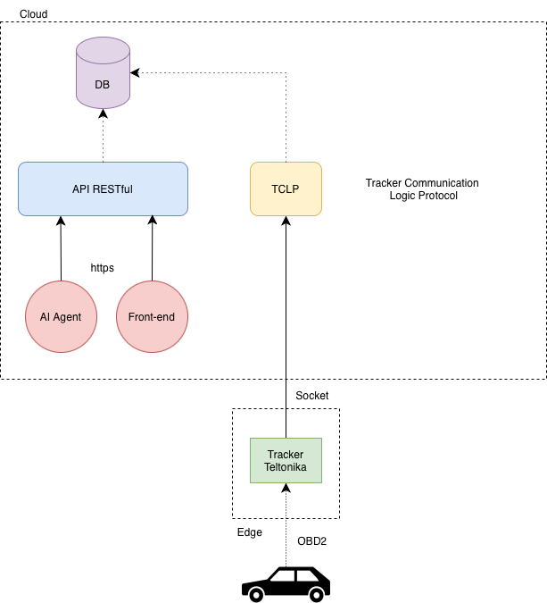
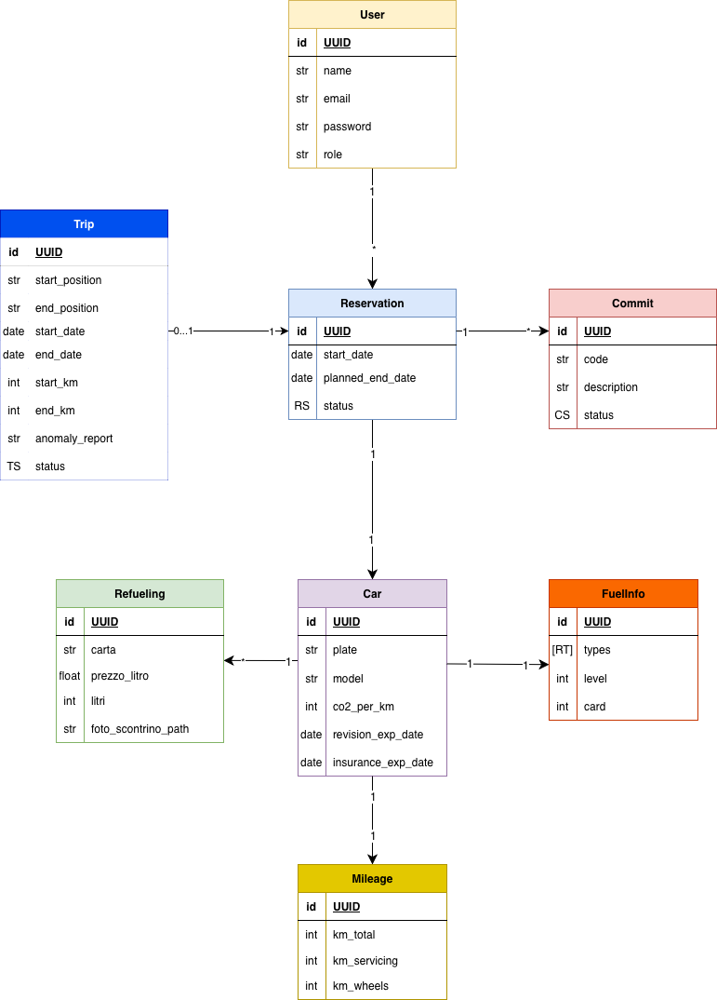

# Cloud-Portable Fleet Management Platform

**Tipo:** applicazione cloud adottata in produzione  
**Ruolo:** Software Architect · Backend Engineer · Cloud Deployment  
**Periodo:** 2026  
**Dominio:** fleet management, sistemi backend, AWS, cloud-portable architecture

---

## Panoramica

Questo caso studio descrive una piattaforma full-stack per gestire operazioni su veicoli aziendali: utenti, auto, prenotazioni, viaggi, rifornimenti, manutenzioni, documenti, statistiche e report.

La scelta architetturale più importante è stata separare la logica applicativa dai servizi cloud usati in produzione. AWS è l’ambiente di produzione, non il modello mentale dell’applicazione.

---

## Problema

I sistemi di fleet management spesso crescono per urgenza operativa: una feature per le prenotazioni, una per i documenti, una per la manutenzione, poi report e statistiche.

Senza una struttura chiara emergono rischi concreti:

- business logic legata alla persistenza
- ambienti locali lontani dalla produzione
- servizi cloud che entrano nel dominio
- osservabilità aggiunta troppo tardi
- modifiche infrastrutturali che richiedono modifiche applicative

L’obiettivo era costruire uno strumento operativo reale mantenendo l’architettura comprensibile e manutenibile.

---

## Architettura

La piattaforma è composta da frontend React, backend FastAPI, layer di persistenza e storage astratti, e deployment AWS basato su serverless e managed services.

---

## Modello Dati

Il modello applicativo copre le principali entità operative: utenti, veicoli, prenotazioni, viaggi, rifornimenti, manutenzioni, commit, file e dati di reporting.

La scelta chiave è modellare queste entità a livello applicativo, non come riflesso diretto di tabelle DynamoDB o oggetti S3.

---

## Cloud Portability

Il backend espone repository e storage contracts. Le implementazioni infrastrutturali gestiscono DynamoDB e S3 in produzione, mentre lo sviluppo locale usa DynamoDB Local e MinIO.

Questo permette di mantenere la stessa architettura applicativa tra:

- sviluppo locale con Docker Compose
- produzione su AWS con Lambda, ECR, DynamoDB, S3, CloudFront, CloudFormation e CloudWatch
- possibili target futuri con cambi limitati agli adapter infrastrutturali

---

## Backend Design

Il backend FastAPI include:

- modelli di dominio per utenti, auto, viaggi, prenotazioni, rifornimenti e manutenzioni
- schemi Pydantic per validazione e API contracts
- autenticazione JWT
- password hashing con Argon2
- repository interfaces basate su Python `Protocol`
- router per user, car, trip, reservation, maintenance, refueling, statistics e reports
- export Excel e report PDF
- logging strutturato delle richieste HTTP

---

## Deployment AWS

Il backend viene pacchettizzato come immagine container, pubblicato su ECR ed eseguito su AWS Lambda tramite Mangum. DynamoDB gestisce la persistenza, S3 conserva documenti e ricevute, CloudWatch raccoglie i log applicativi.

Il frontend React/TypeScript viene distribuito come build statica su S3 privata e servito tramite CloudFront con Origin Access Control.

---

## Cosa Dimostra

Questo progetto dimostra esperienza in:

- architettura applicativa cloud-portable
- deployment serverless su AWS
- architettura backend con FastAPI
- infrastructure abstraction
- ambienti locali Docker Compose
- Infrastructure as Code con CloudFormation
- osservabilità orientata alla produzione
- rilascio di un’applicazione reale
