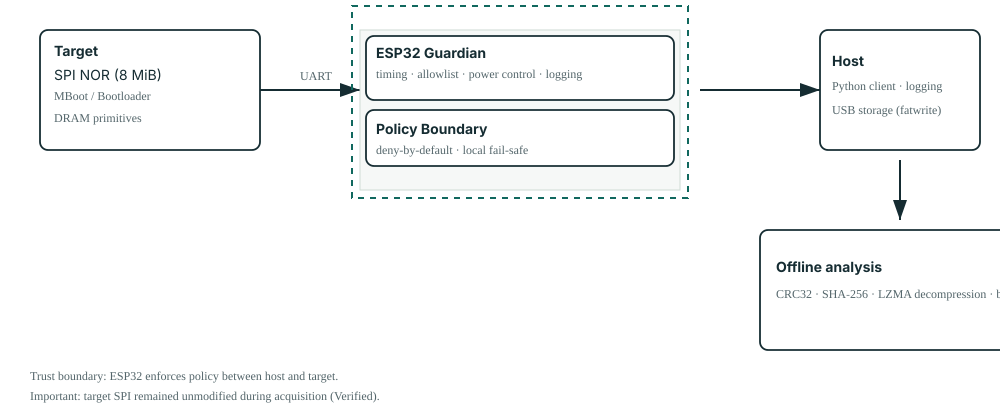
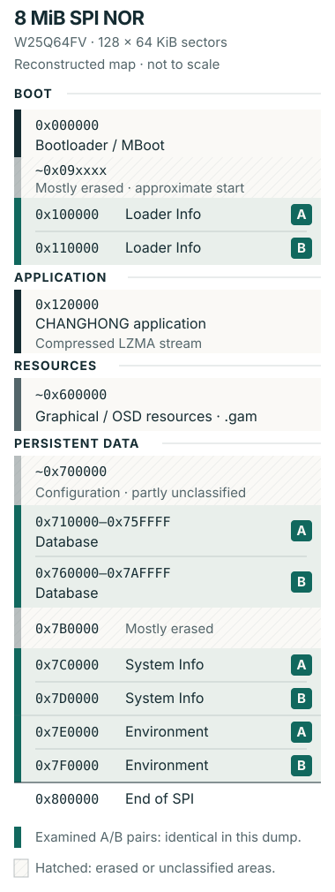

<p class="portfolio-eyebrow">2026 / REVERSE ENGINEERING EMBEDDED · ANALISI FIRMWARE</p>

# HumaxGuardian

<p class="portfolio-lead">Da una UART non documentata a un'immagine firmware verificata.</p>

Un percorso controllato di reverse engineering su un sistema embedded basato su MStar, che combina una policy applicata sull'ESP32, interazione con MBoot, acquisizione verificata della SPI e analisi offline del firmware.

**Tipo:** Caso studio / Strumenti open source<br>
**Ruolo:** Ricerca e sviluppo indipendenti<br>
**Periodo:** 2026<br>
**Ambito:** Sistemi embedded · Firmware · Reverse engineering<br>
**Repository:** [HumaxGuardian su GitHub](https://github.com/atellaluca/humax-mstar-guardian)

---

## La sfida

Il punto di partenza era un ricevitore DVB-T Humax/Changhong costruito su una piattaforma MStar non documentata. Volevo comprenderne l'avvio e acquisire una rappresentazione verificabile del firmware mantenendo inalterata la SPI del dispositivo.

Le sigle sulla scheda e l'output di avvio hanno progressivamente identificato il sistema: **MStar MSD3T273 / MSA3T273Z-Z00-DA0E**, **U-Boot 2011.06 / MStar MBoot personalizzato**, con una build interna di MBoot datata **Apr 27 2020**. Le evidenze nell'applicazione hanno poi indicato un **ambiente CH_RTOS / riconducibile a eCos**. Non si trattava di un sistema Linux convenzionale: l'indagine doveva seguire le interfacce e le strutture effettivamente presenti.

Il primo problema era quindi ottenere visibilità. Ogni esperimento doveva rispondere a una domanda circoscritta, conservare evidenze sufficienti per controllare il risultato e orientare il passo successivo. HumaxGuardian è nato da questi vincoli.

<div class="portfolio-proof" markdown>
**Come leggere le evidenze**

*Osservato* indica un dato ottenuto direttamente dalla scheda, dalla UART, dal bootloader o dal dump acquisito. *Verificato* indica una conferma tramite un controllo aggiuntivo. *Inferito* identifica un'interpretazione sostenuta dalle evidenze, il cui significato non è stato dimostrato completamente.
</div>

## Trovare un punto di accesso

Una connessione UART rendeva visibile la sequenza di avvio a **115200 baud, 8N1**. Un **ESP32-WROOM-32** era interposto tra il dispositivo e il computer host, consentendo di osservare gli eventi seriali e controllare localmente l'alimentazione.

| Collegamento | Configurazione di ricerca |
| --- | --- |
| Humax TX → ESP32 RX2 | `GPIO16` |
| Humax RX ← ESP32 TX2 | `GPIO17` |
| Massa | GND comune |
| Seriale USB ESP32 → host | `921600` baud |
| Controllo del relè | `GPIO25`, attivo LOW; commuta i `+12 V` del dispositivo |

Il relè rendeva ripetibili gli esperimenti di avvio a freddo. I cicli di alimentazione e l'osservazione della UART potevano essere coordinati dall'ESP32, senza dipendere dai tempi di un collegamento manuale dell'alimentazione o di uno scambio seriale con l'host.

## Un bootloader senza ritardo di avvio

La configurazione osservata conteneva `bootdelay=0`. Di fatto non esisteva una normale finestra interattiva per interrompere l'autoboot, quindi digitare manualmente nella console non offriva un modo affidabile per fermare l'avvio.

Ripetendo gli avvii a freddo è emerso un riferimento temporale utile nell'output UART: `Changelist`. Sulla build MBoot esaminata, inviare **un solo carriage return (`0x0D`)** alla comparsa di quel marcatore interrompeva l'autoboot e produceva il prompt `k5tn#`.

L'ESP32 rilevava il marcatore localmente e inviava il CR prima di inoltrare la telemetria all'host. Il riconoscimento del prompt disarmava poi l'intercettazione. Si tratta di un comportamento osservato sperimentalmente su quella specifica build, senza affermare l'esistenza di un exploit generico del bootloader.

## Da bridge a guardian

Il bridge seriale iniziale aveva risolto il problema dell'accesso. Una volta disponibile la console del bootloader, però, un percorso trasparente dall'input dell'operatore a MBoot esponeva anche comandi potenti a errori di digitazione e problemi lato host. La decisione progettuale successiva è stata spostare la policy dei comandi sull'ESP32.

<div class="portfolio-card-grid" markdown>
<div class="portfolio-proof" markdown>
**Bridge trasparente**

Host ↔ UART ↔ Dispositivo

L'input dell'operatore raggiunge il bootloader attraverso un percorso di inoltro.
</div>
<div class="portfolio-proof" markdown>
**Guardian**

Host → Policy ESP32 → Dispositivo

**Comportamento predefinito: negare.** Le stringhe dei comandi MBoot devono corrispondere esattamente all'allowlist del firmware.
</div>
</div>

<figure class="case-study-visual" markdown>
{ width="380" height="844" loading="lazy" decoding="async" }
<figcaption>L'ESP32 governa i comandi diretti al dispositivo. I dati acquisiti passano dalla RAM del dispositivo alla memoria USB esterna attraverso MBoot.</figcaption>
</figure>

**Sicurezza nell'architettura:** l'ESP32 è l'autorità che applica la policy dei comandi. Controlla l'alimentazione del dispositivo, rileva gli eventi di avvio, temporizza il CR, riconosce il prompt, verifica l'allowlist esatta e riporta i dati UART e gli eventi del guardian. Le richieste di esecuzione vengono rifiutate se la console non è pronta o il comando è assente dall'allowlist.

L'host Python fornisce l'interfaccia operatore, i log testuali e grezzi e la gestione del ciclo di vita della sessione. Modificare soltanto il client Python non consente di inviare comandi MBoot arbitrari attraverso il firmware pubblico del guardian.

Il comportamento fail-safe ha un ambito preciso: l'ESP32 inizializza il relè mantenendo spento il dispositivo; Python tenta di disarmare l'intercettazione e togliere alimentazione durante la chiusura della sessione, anche in caso di errori seriali gestiti e Ctrl+C. L'implementazione pubblica non offre una garanzia tramite watchdog di spegnimento immediato quando l'host viene scollegato.

Le categorie di comandi distinguono ispezione, letture dal dispositivo, letture USB e scritture USB. **L'allowlist pubblica non espone intenzionalmente operazioni di cancellazione o scrittura della SPI.** `fatwrite` scrive su un filesystem FAT di una memoria USB esterna, quindi il flusso completo non è di sola lettura. **La SPI del dispositivo è rimasta inalterata durante l'acquisizione.**

## Dalla SPI a un'immagine verificata

Il dispositivo utilizzava una **SPI NOR W25Q64FV**: **8 MiB (`0x00800000` byte)**, organizzati qui in **128 settori da 64 KiB (`0x10000` byte)**. MBoot esponeva una primitiva capace di copiare l'intera flash in RAM con una sola operazione:

```text
spi rdc 0x81000000 0x00000000 0x00800000
```

Il CRC32 del buffer in RAM restituiva `89BFAD81`. Il passo successivo esportava il buffer su una memoria FAT collegata alla porta USB del dispositivo. Una particolarità osservata di MBoot era determinante: **il file di destinazione doveva già esistere** perché il flusso con `fatwrite` riuscisse.

Il comando di esportazione ammesso era `fatwrite usb 0 0x81000000 firmware.bin 0x00800000`. Il file `firmware.bin` risultante conteneva **8,388,608 byte**. Per controllare il passaggio attraverso la memoria USB, l'ho ricaricato in una regione RAM separata:

```text
fatload usb 0:1 0x82000000 firmware.bin
```

Il CRC32 dopo il caricamento era nuovamente `89BFAD81`. Offline, anche l'immagine master verificata e la sua copia producevano lo stesso SHA-256.

<div class="portfolio-proof" markdown>
**Verifica dell'acquisizione**

- **SPI NOR:** 8 MiB
- **Dimensione del dump:** 8,388,608 byte
- **CRC32, RAM sorgente e ricaricamento USB:** `89BFAD81`

<p><strong>SHA-256, master verificato e copia:</strong><br><code class="case-study-digest">de7b98ffea94c77f15e12c8e644d52586ba6dff24c5ae3f08108f9f1ed252e64</code></p>
</div>

La corrispondenza dei CRC32 è una forte evidenza che esportazione e ricaricamento abbiano preservato i dati, ma non costituisce una prova matematica dell'identità byte per byte. La corrispondenza degli SHA-256 ha fornito il controllo d'integrità offline più forte usato per la coppia master/copia. Nessuno dei due controlli stabilisce che il firmware sia di per sé affidabile o completamente compreso.

## Spostare l'indagine offline

Una volta acquisita e controllata l'immagine completa, la maggior parte delle domande non richiedeva più una console sul dispositivo acceso. L'analisi si è spostata sulla copia verificata, riducendo l'interazione con il dispositivo e rendendo ogni ispezione ripetibile senza un nuovo ciclo di avvio.

Il comando di avvio osservato forniva un'ipotesi concreta sulla disposizione dell'applicazione:

```text
spi_rdc 0x82B00000 0x00120000 0x4e0000;
LzmaDec 0x82B00000 0x4e0000 0x80000180 0x82500000;
go 0x80000224;
```

La sequenza indicava dati applicativi a partire da circa l'offset SPI `0x120000`, seguiti da decompressione ed esecuzione in RAM. **Verificato:** a quell'offset nel dump era presente un flusso LZMA valido; la decompressione offline ha prodotto un'immagine applicativa di circa **16,2 MB**. Questo collegava il comportamento osservato durante l'avvio a una struttura esaminabile in modo indipendente.

L'applicazione decompressa conteneva `CHANGHONG Application R&d`, `Chip MSD3T273`, `CH_RTOS` e la stringa interna del firmware **`Build Feb 24 2022`**. Quest'ultima data appartiene al firmware del dispositivo; **il progetto di ricerca è del 2026**.

Altre evidenze includevano `MXL608`, `DVB-T` / `DVB-T2`, `PVR`, `Wi-Fi`, `Ethernet` e `FTP`. La presenza di codice e stringhe correlati indica materiale disponibile per ulteriori analisi. Non dimostra che Wi-Fi, FTP o tutte le funzionalità citate fossero abilitate nel prodotto commerciale.

## Ricostruire la flash

Parametri di avvio, decompressione e ispezione dei byte acquisiti sostenevano una mappa di lavoro dell'immagine da 8 MiB. La mappa distingueva codice di avvio, applicazione compressa, risorse grafiche e dati persistenti, lasciando esplicitamente non classificate le regioni incerte.

<figure class="case-study-visual" markdown>
{ width="380" height="1010" loading="lazy" decoding="async" }
<figcaption>Una mappa di lavoro, con i record piccoli ingranditi per facilitarne la lettura. I confini approssimativi e le classificazioni incomplete restano espliciti.</figcaption>
</figure>

| Offset / intervallo SPI | Interpretazione di lavoro |
| --- | --- |
| `0x000000` | Bootloader / MBoot |
| Circa `0x09xxxx` | Inizio di una regione prevalentemente cancellata; confine approssimativo |
| `0x100000` / `0x110000` | Loader Info A / B |
| `0x120000` | Applicazione CHANGHONG compressa; flusso LZMA valido |
| Intorno a `0x600000` | Risorse grafiche / OSD, inclusi file `.gam` |
| Intorno a `0x700000` | Area persistente / di configurazione, non completamente classificata |
| `0x710000–0x75FFFF` | Database A |
| `0x760000–0x7AFFFF` | Database B |
| `0x7B0000` | Prevalentemente cancellata |
| `0x7C0000` / `0x7D0000` | System Info A / B |
| `0x7E0000` / `0x7F0000` | Environment A / B |
| `0x800000` | Fine della SPI |

Questa mappa è una base per l'indagine e non implica che ogni struttura sia stata ricostruita tramite reverse engineering. Riconoscere una regione e decodificare completamente un formato dati sono risultati diversi.

## Scoprire la ridondanza

Le strutture persistenti hanno rivelato quattro coppie: **Loader Info A/B, Database A/B, System Info A/B ed Environment A/B**. Le corrispondenti coppie A/B esaminate erano identiche nel dump acquisito.

Questo confronto verifica la duplicazione nell'immagine. La ridondanza è un'interpretazione sostenuta dalla disposizione dei dati, ma il solo confronto non stabilisce l'ordine di aggiornamento, il comportamento di ripristino o quale copia l'applicazione in esecuzione preferirebbe dopo un guasto.

Gli identificatori del database includevano `xpdr0001`, `serv0001` e `tmer0001`. **Inferito:** sono coerenti rispettivamente con strutture per transponder, servizi/canali e timer. La loro presenza ha aiutato a organizzare le analisi successive; il formato del database non è stato decodificato completamente.

## I risultati dell'indagine

Il risultato è stato un insieme collegato di strumenti ed evidenze tecniche:

- Una configurazione ripetibile per l'avvio a freddo e un metodo stabilito sperimentalmente per raggiungere il prompt della build MBoot esaminata.
- Un firmware guardian ESP32/C++ che applica localmente una policy esatta dei comandi, affiancato da strumenti Python per operatività, ciclo di vita e registrazione delle evidenze.
- Un'acquisizione completa da 8 MiB, controllata tramite esportazione e ricaricamento USB e hash offline di master e copia.
- Un'applicazione decompressa, una mappa di lavoro della flash e coppie duplicate confermate, con i limiti interpretativi ancora presenti documentati.
- Codice sorgente pubblico e documentazione tecnica sugli strumenti e sui vincoli specifici del dispositivo esaminato.

La sequenza ha collegato l'osservazione della scheda alla temporizzazione seriale, al comportamento del bootloader, alla policy embedded, all'integrità dell'acquisizione e all'analisi binaria. Ogni livello ha fornito evidenze per il successivo.

## Metodo

<div class="portfolio-proof" markdown>
**Osservare → Formulare ipotesi → Sperimentare → Verificare → Automatizzare → Analizzare offline**
</div>

L'osservazione ha fornito il marcatore temporale; i test controllati hanno stabilito l'intervento; il guardian ha codificato i vincoli operativi. La verifica ha permesso di allontanare l'indagine dal dispositivo acceso ed esaminarne una rappresentazione stabile.

Il principio è trasferibile: costruire un modello a partire dalle evidenze, codificare i vincoli negli strumenti e **ridurre l'interazione con il dispositivo acceso una volta disponibile una rappresentazione verificata**.

<div class="portfolio-contact" markdown>

## Esplora HumaxGuardian su GitHub

Il repository contiene il firmware guardian per ESP32, gli strumenti host Python e la documentazione tecnica dell'architettura e del protocollo. Il codice scritto dall'autore è distribuito con licenza MIT. **Il firmware proprietario del dispositivo e i dump binari non vengono distribuiti.**

[Esplora HumaxGuardian su GitHub](https://github.com/atellaluca/humax-mstar-guardian){ .md-button .md-button--primary }

</div>

---

[Torna ai casi studio](../index.md)
