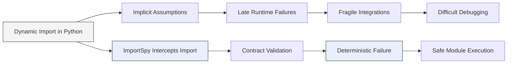
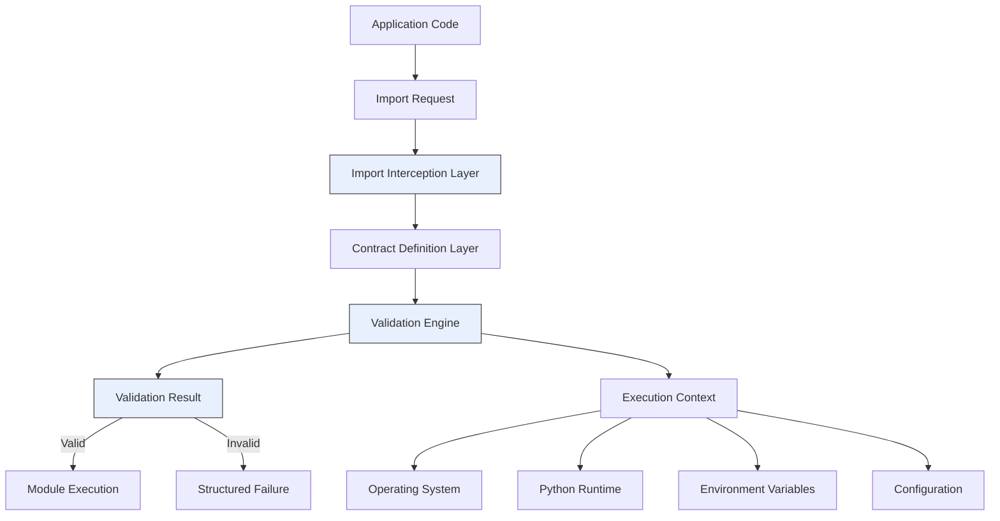

# ImportSpy — Runtime Import Contracts for Modular Python Systems

**Type:** Open-source software project  
**Role:** Project Lead & Software Architect  
**Period:** 2024 – Present  
**Domain:** Python, modular systems, runtime validation  
**Repository:** [ImportSpy on GitHub — runtime contract engine for Python](https://github.com/atellaluca/importspy)  
**Adoption:** 15,000+ downloads on PyPI  

---

## Overview

ImportSpy is an open-source Python library designed to enforce **runtime contracts at module import time**.  
Its goal is to prevent unsafe or incompatible modules from being loaded into a running system by validating their structural, environmental, and contextual properties before execution.

The project was conceived to address a recurring problem in **modular architectures, plugin-based systems, and extensible platforms**:  
the lack of a reliable mechanism to ensure that dynamically loaded components satisfy predefined integration requirements.

ImportSpy introduces a **contract-driven validation layer** that operates at import time, enabling developers to:

- enforce structural constraints on modules  
- validate runtime environment assumptions  
- prevent unsafe or incompatible imports  
- fail fast before corrupted system states are reached  

---

## Problem Statement

In modern Python systems, dynamic imports are widely used to support:

- plugin architectures  
- runtime extensibility  
- dependency injection  
- distributed and modular services  

However, Python’s import system provides **no built-in mechanism** to:

- verify the structure of imported modules  
- validate required functions, classes, or interfaces  
- enforce environmental or contextual constraints  
- prevent incompatible runtime conditions  

As a result, many systems rely on:

- implicit assumptions  
- ad-hoc runtime checks  
- late failures occurring deep in the execution flow  

This leads to fragile integrations, unpredictable failures, and difficult-to-debug runtime errors.

### Problem → Solution Flow

---

## Design Goals

ImportSpy was designed around the following core principles:

- **Fail fast:** detect incompatibilities at import time  
- **Declarative contracts:** express requirements as structured schemas  
- **Low coupling:** keep contracts independent from implementation  
- **Runtime safety:** prevent invalid modules from entering the system  
- **Extensibility:** support future validation rules and constraints  
- **Minimal intrusion:** avoid invasive changes to application code  

---

## High-Level Architecture

At a conceptual level, ImportSpy is structured as a runtime governance pipeline that intercepts module imports and validates them against declarative contracts before execution.

---

## Applications and Use Cases

ImportSpy is applicable to a wide range of scenarios, including:

- plugin-based systems  
- modular backends  
- microservice bootstrapping  
- CI/CD validation pipelines  
- IoT and edge platforms  
- secure runtime environments  

---

## Talks & Community

The architectural concepts behind ImportSpy have been shared publicly within technical communities as part of a broader effort to promote runtime governance patterns for modular and extensible Python systems.

### ImportSpy: Quando i moduli Python sanno dire di no.
**GDG Basilicata · Flash Talks Arena**

A community talk focused on *import-time contracts* and how modular systems can enforce architectural assumptions (Python version, OS, environment variables, and other runtime constraints) before executing non-conforming modules.

This talk introduces ImportSpy not as a utility library, but as an architectural governance layer for plugin-based and long-running backend systems.

**Resources**

- Slides (PDF, Italian): [ImportSpy GDG Basilicata talk — Runtime import contracts for Python](../../assets/talks/importspy-gdg-basilicata-it.pdf)  
- Slides (PDF, English — technical translation): [Runtime Contract Validation in Modular Python Systems](../../assets/talks/importspy-runtime-contract-validation-en.pdf)  
- Official GDG Basilicata event page: [Flash Talks Arena — ImportSpy session](https://gdg.community.dev/events/details/google-gdg-basilicata-presents-flash-talks-arena/)  
- Community listing: [PignolaLUG — Flash Talks Arena (ImportSpy)](https://www.pignolalug.it/iniziative/flash-talks-arena/)

---

## My Role

I designed and implemented ImportSpy end-to-end, starting from the conceptual architecture and evolving it into a production-ready open-source system.

My work covered the definition of the contract model, the design of the validation engine, and the implementation of the runtime import interception mechanism, with a strong focus on determinism, clarity, and architectural correctness. I also curated the project documentation, packaging, and release workflow to ensure long-term maintainability and ease of adoption.

Through this project, I consolidated my experience in software architecture, runtime systems, modular design, and DevSecOps-oriented tooling, while leading the full lifecycle of an open-source initiative from initial design to public release.