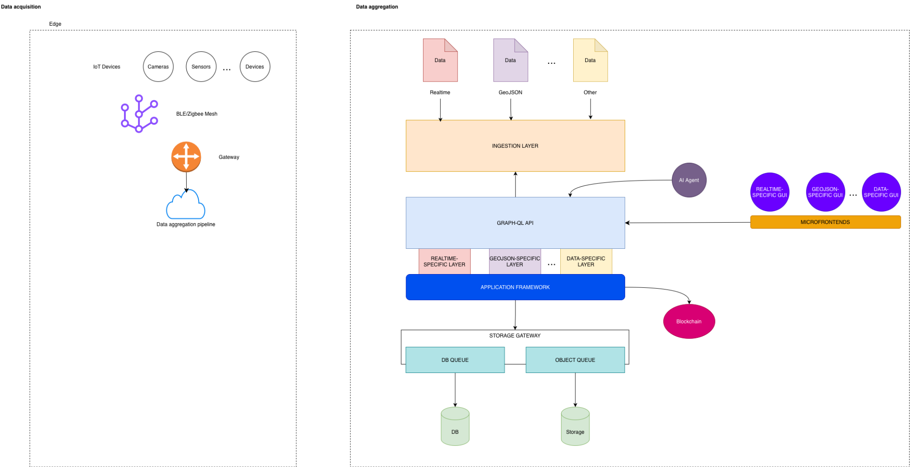
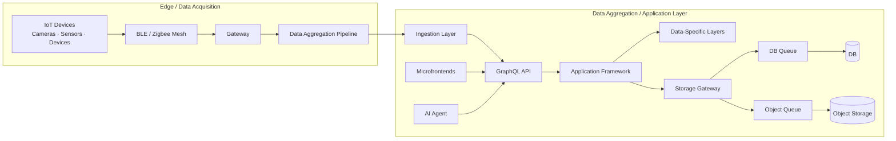

# IoT Data Aggregation Architecture for Digital Twin Systems

**Type:** Architecture concept / design proposal  
**Role:** Software Architect  
**Context:** Technical discussion with CNR and Sviluppo Basilicata  
**Domain:** IoT, Digital Twin, edge/cloud data aggregation  
**Status:** Conceptual architecture  

---

## Overview

This case study presents a conceptual edge-to-cloud architecture for collecting, aggregating, and exposing heterogeneous IoT data in Digital Twin scenarios.

The design separates data acquisition from data aggregation and introduces an application framework capable of handling multiple data-specific layers, including real-time streams, GeoJSON data, and other domain-specific formats.

The goal was to reason about how heterogeneous physical-world data can be normalized, stored, queried, and visualized without coupling the acquisition layer to a single frontend, storage model, or data type.

---

## Context

The architecture was developed in the context of a technical discussion involving CNR, Sviluppo Basilicata, and the Academy environment.

It should be read as a **conceptual architecture**, not as a production deployment. Its value lies in the system design: the separation of edge acquisition, ingestion, aggregation, API exposure, visualization, and advanced processing.

---

## Problem Space

Digital Twin systems require data from many heterogeneous sources:

- cameras
- sensors
- IoT devices
- gateway networks
- real-time telemetry
- geospatial data
- domain-specific data formats

A recurring architectural risk is treating all incoming data as if it had the same lifecycle, structure, storage needs, and visualization model.

The design addresses this by separating:

- edge acquisition
- ingestion
- data-specific processing
- application framework behavior
- API exposure
- storage paths
- visualization surfaces

---

## Architecture Overview

The architecture is divided into two main macro-areas:

1. **Data acquisition at the edge**
2. **Data aggregation and application services**

---

## Data Acquisition Layer

The edge side of the architecture collects data from heterogeneous sources such as cameras, sensors, and generic IoT devices.

A BLE/Zigbee mesh acts as the local communication fabric, while a gateway bridges edge data into the aggregation pipeline.

This design keeps device-level communication concerns separated from the application framework and storage architecture.

The edge layer is responsible for:

- collecting data from physical devices
- handling local connectivity constraints
- aggregating signals before cloud ingestion
- minimizing direct coupling between devices and application services

---

## Ingestion and Data Aggregation

The ingestion layer accepts different categories of data, including:

- real-time data
- GeoJSON data
- other domain-specific formats

Instead of forcing every data type into a single generic pipeline, the architecture introduces **data-specific layers** under a common application framework.

This makes it possible to define different processing, storage, and visualization strategies depending on the nature of the data.

---

## API and Application Framework

The GraphQL API acts as a query and aggregation boundary between frontend surfaces, AI agents, and backend application layers.

GraphQL is useful in this context because different consumers may need different projections of the same underlying data:

- dashboards may need real-time status
- geospatial views may need GeoJSON data
- analytics services may need aggregated historical data
- AI agents may need contextualized data access

The application framework coordinates these access patterns without exposing internal storage or ingestion details directly to clients.

---

## Microfrontend Strategy

The architecture includes data-specific microfrontends:

- real-time-specific GUI
- GeoJSON-specific GUI
- other data-specific GUI modules

This avoids forcing a single frontend model over heterogeneous data types.

Each microfrontend can evolve independently while consuming data through the shared API layer and application framework.

The approach is aligned with the broader idea of modular systems: different data domains can have different interaction models without fragmenting the whole platform.

---

## Storage Gateway

The storage gateway separates application logic from persistence concerns.

It routes data toward:

- DB-oriented queues for structured data
- object queues for files, media, payloads, or large semi-structured artifacts
- persistent database storage
- object storage

This prevents ingestion and application logic from depending directly on concrete storage mechanisms.

The storage gateway becomes the architectural boundary between data processing and persistence.

---

## AI and Advanced Processing

The diagram includes an AI agent as an external intelligence layer interacting with the application/API layer.

In this architecture, AI is not treated as a replacement for the application framework. It is modeled as an additional consumer of structured, governed, and contextualized data.

This distinction matters: the AI layer should operate on data exposed through architectural boundaries rather than bypassing the system model.

---

## Design Principles

The architecture is based on several principles:

- separate edge acquisition from cloud aggregation
- avoid coupling devices directly to frontend views
- support heterogeneous data types through data-specific layers
- expose data through a governed API boundary
- separate application logic from storage mechanisms
- allow visualization layers to evolve independently
- keep advanced processing and AI behind explicit system boundaries

---

## My Role

I designed the architecture as a conceptual model for edge-to-cloud IoT data aggregation in Digital Twin scenarios.

My contribution focused on structuring the system boundaries: edge acquisition, gateway communication, ingestion, GraphQL API, application framework, data-specific layers, microfrontends, storage gateway, and AI-assisted processing.

The work extends my broader architectural focus on modular systems, integration-heavy platforms, and runtime boundaries into an edge/cloud and Digital Twin context.

---

## What This Case Study Demonstrates

This case study demonstrates experience in:

- edge-to-cloud architecture
- IoT data acquisition
- heterogeneous data aggregation
- Digital Twin system design
- GraphQL API positioning
- microfrontend architecture
- storage abstraction
- AI-enabled data access patterns
- conceptual architecture for complex systems

---

## Read Next

- [Back to case studies](../index.md)
- [Cloud-Portable Fleet Management Platform](../cloud-portable-fleet-platform/index.md)
- [Technical profile](../../profile.md)
- [CV](../../cv.md)
- [Contact](../../contact.md)
