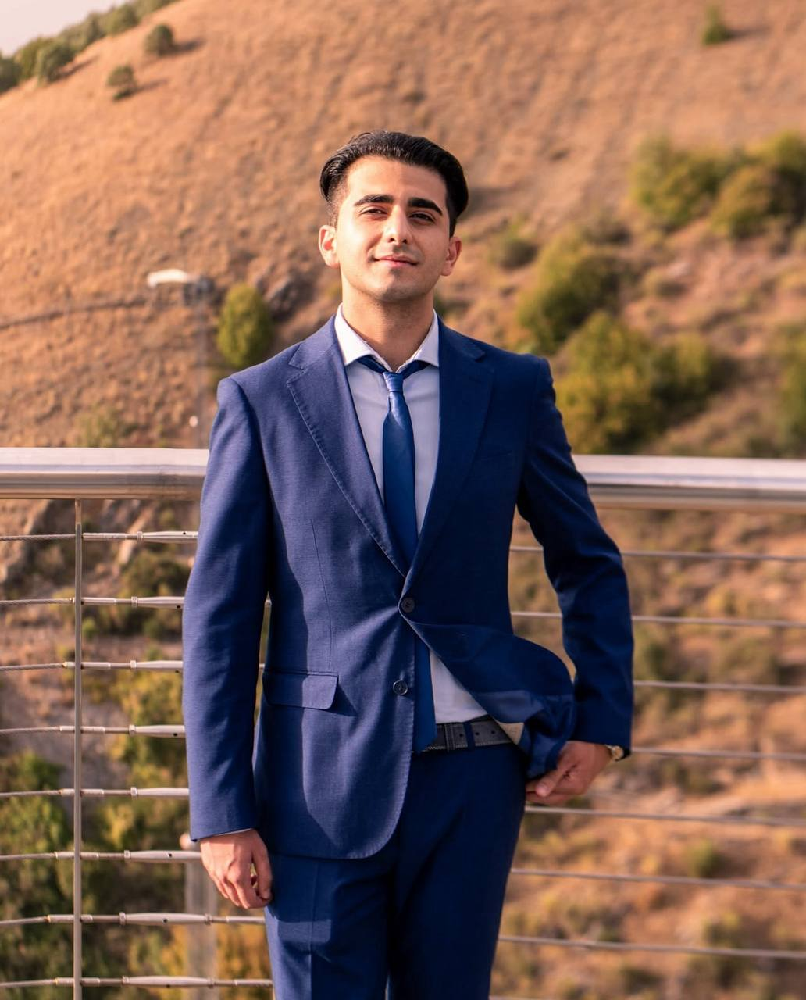

SOFTWARE ARCHITECT · BACKEND ENGINEER

# Luca Atella

Dall’architettura al software che lavora in produzione.

Progetto e sviluppo backend Python, API e piattaforme cloud. Aiuto i team a collegare dati, servizi e infrastruttura con sistemi che restano comprensibili quando il prodotto cresce.

Basilicata, Italia · Collaborazioni da remoto e in modalità ibrida

[Parliamo di un’opportunità](contact.md){ .md-button .md-button--primary }
[Esplora i progetti](#progetti-selezionati){ .md-button }

[Leggi il CV](cv.md) · [LinkedIn](https://www.linkedin.com/in/luca-atella/) · [English version](/)

{ width="1032" height="1280" fetchpriority="high" loading="eager" decoding="async" }

Confini chiari. Integrazioni affidabili. Software che può evolvere.

**Esperienza in produzione**

Piattaforma fleet management adottata in un contesto aziendale reale.

**Progettazione e sviluppo**

Dalle API FastAPI al deployment AWS, passando per ambienti locali riproducibili.

**Open source e ricerca**

ImportSpy per i contratti runtime. B3DO per l’elaborazione geospaziale.

## Progetti selezionati

Il problema, le scelte progettuali e il sistema risultante. Ogni caso studio distingue il lavoro in produzione dai progetti open source e dalle architetture di riferimento.

01 / PIATTAFORMA IN PRODUZIONE

### Fleet management, dal locale ad AWS

**Il problema:** gestire veicoli, prenotazioni, manutenzioni e documenti senza legare la logica applicativa a un solo ambiente.

**Il lavoro:** backend FastAPI, frontend React/TypeScript, repository e storage astratti. Sviluppo con Docker Compose e deployment serverless su AWS.

Python · FastAPI · DynamoDB · S3 · Lambda

[Architettura e scelte del progetto →](case-studies/cloud-portable-fleet-platform/index.md)

02 / PROGETTO OPEN SOURCE

### ImportSpy: contratti espliciti tra moduli

**Il problema:** i sistemi a plugin possono fallire quando un modulo non rispetta struttura e vincoli di esecuzione attesi.

**Il lavoro:** un motore Python che verifica contratti durante l’import e restituisce violazioni strutturate per rendere diagnosticabili le incompatibilità.

Python · Plugin · Runtime validation · DSL

[Esplora il motore di validazione →](case-studies/importspy/index.md)

03 / PIPELINE GEOSPAZIALE · NON PUBBLICATA

### B3DO: dati della Basilicata, in tre dimensioni

Una pipeline per trasformare dataset pubblici del terreno in modelli 3D: ritaglio dei raster, livelli di dettaglio, mesh e texture, con un workflow da riga di comando.

Python · GDAL · Rasterio · NumPy · PyVista

[Dal dato al modello 3D →](case-studies/b3do/index.md)

04 / ARCHITETTURA DI RIFERIMENTO

### Dati IoT utilizzabili nei Digital Twin

Un’architettura edge-to-cloud per integrare sensori, dispositivi e sorgenti eterogenee: acquisizione, aggregazione e accesso ai dati attraverso confini espliciti.

IoT · Edge/cloud · GraphQL · Data integration

[Esplora l’architettura Digital Twin →](case-studies/iot-data-aggregation-digital-twin/index.md)

[Tutti i casi studio, inclusi backend unificato e telemetria →](case-studies/index.md)

## Cosa porto nel team

### Backend e API

Python, FastAPI, modellazione dati e sistemi modulari. Confini chiari tra logica di business, integrazioni e persistenza.

### Cloud e operatività

AWS, Docker e Infrastructure as Code. Ambienti riproducibili, deployment e osservabilità considerati insieme al codice.

### Decisioni documentate

Contratti espliciti, errori comprensibili e scelte motivate. Un sistema deve poter essere mantenuto anche da chi arriva dopo.

[Il mio metodo](methodology.md) · [Profilo tecnico](profile.md) · [Percorso e certificazioni nel CV](cv.md) · [Chi sono](about.md)

IL PROSSIMO PROGETTO

## Cerchi una figura backend o software architect?

Mi interessano opportunità in backend engineering, platform engineering e architettura software. Raccontami il prodotto, il team e il problema da affrontare.

[Scrivimi via email](mailto:info@atellaluca.com){ .md-button .md-button--primary }
[Scarica il CV in PDF](assets/cv/Luca-Atella-CV.pdf){ .md-button }

Oppure [contattami su LinkedIn](https://www.linkedin.com/in/luca-atella/).

