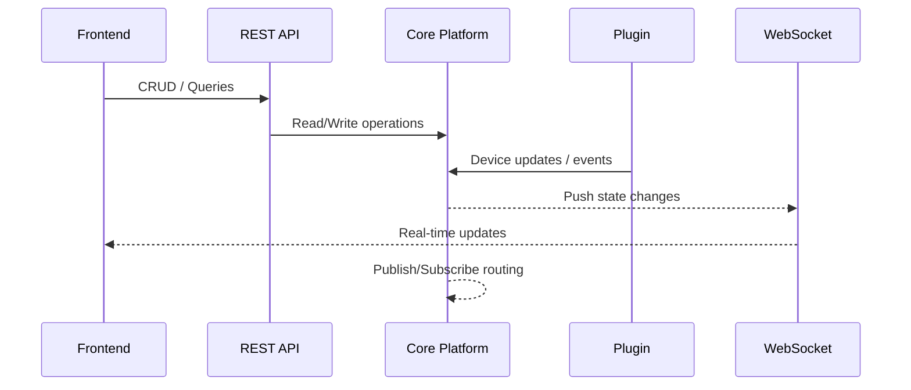

# Architecture
## Unified Backend for Heterogeneous Data Sources (SAFE)

---

## Architectural Overview

This system is a **centralized backend framework** designed to integrate heterogeneous devices and data sources
through a **repeatable, plugin-driven architecture**.

At a high level, the platform provides:

- a consistent RESTful CRUD model for core resources
- a unified data model to represent heterogeneous devices
- a real-time channel (WebSocket) to propagate updates to frontends
- a publish/subscribe layer for device events and state changes
- a plugin lifecycle and extension model to avoid rewriting integration logic per device family
- contract-based plugin validation (runtime contracts)
- a CLI control plane for repeatable development, testing, packaging, and deployment workflows

This case study is presented in a SAFE form: it intentionally avoids product identifiers,
real endpoints, proprietary protocols, and implementation fingerprints.

---

## High-Level Platform Architecture

The architecture can be understood as a layered platform with explicit boundaries between:

- frontend integration (REST + WebSocket)
- core platform services (model, validation, eventing)
- plugin execution (device/domain-specific logic)
- external systems and devices (heterogeneous sources)

```mermaid
flowchart TB
  UI[Frontend UI] <--> API[Service Layer / API]
  API <--> CORE[Core Platform]

  subgraph CORE
    MODEL[Unified Device Model]
    VALID[Validation & Invariants]
    EVENTS[Eventing (Pub/Sub)]
    STORE[(Persistence / State)]
  end

  CORE <--> PLUGINS[Plugin Execution Layer]
  PLUGINS <--> EXT[External Devices & Systems]

  API --> MODEL
  CORE --> VALID
  CORE --> EVENTS
  CORE --> STORE
```

This structure keeps the system evolvable:

- plugins encapsulate heterogeneity
- the core governs invariants and contracts
- frontend integration stays stable as the ecosystem grows

---

## Resource Model (Abstract)

The core API follows a repeatable CRUD model over a small set of conceptual resources.
Names and identifiers are intentionally abstracted.

Typical resource groups include:

- **Workspace / Service Context**  
  A scoped environment used to isolate deployments or tenants.

- **Installation / Site**  
  A container representing a physical or logical environment where devices are managed.

- **Gateway / Connector**  
  A connection point to an external ecosystem or device domain
  (e.g., a remote service, controller, or network endpoint).

- **Device**  
  A normalized representation of a device, independent from vendor protocol.

This structure enables a consistent lifecycle across heterogeneous ecosystems.

---

## Unified Device Model

To unify heterogeneous devices under one backend and one frontend integration model,
devices are represented using a consistent internal schema.

A typical device representation includes:

- **information**  
  Identity and descriptive metadata (id, name, category, location hints).

- **properties**  
  A key/value map representing state and measurements.

- **actions**  
  Callable operations exposed by the device, represented as action identifiers.

- **widget**  
  A declarative UI schema describing frontend rendering and interactions.

This model keeps downstream services and frontends device-agnostic.

---

## Declarative UI Schema (Widget DSL)

A key architectural choice is the use of a **declarative UI schema**
to describe frontend rendering and interactions.

Plugins provide a JSON-based schema that can encode:

- UI components (toggle, slider, numeric input, chart)
- bindings to device properties
- event listeners mapping UI interactions to device actions

This yields:

- faster UI iteration
- consistent UX across heterogeneous devices
- a stable contract between device models and frontend rendering

In SAFE documentation, UI schema examples should be toy-oriented and non-identifying.

---

## Plugin Model and Lifecycle

The platform’s extensibility relies on a plugin architecture.

A plugin:

- extends the platform core
- implements a well-defined set of methods, typically including:
  - **discovery**: how devices are identified and enumerated
  - **mapping**: how raw data is transformed into the unified model
  - **actions**: how operations are exposed and executed
  - **subscriptions**: how device events/state updates are propagated

The platform core provides:

- a consistent execution context
- shared infrastructure (persistence, eventing, real-time updates)
- governance (validation and contracts)

---

## Runtime Contracts and Plugin Governance

Plugins are validated through **runtime contracts** to ensure they meet platform expectations.

Contract enforcement guarantees that plugins:

- implement required methods and structures
- respect platform invariants and integration rules
- produce device models compatible with the unified schema
- expose actions and UI schemas in a predictable way

```mermaid
flowchart LR
  P[Plugin Package] --> CV[Contract Validation]
  CV -->|valid| INIT[Initialize Context]
  CV -->|invalid| REJ[Reject Plugin]

  INIT --> DISC[Discovery Phase]
  DISC --> MAP[Mapping Phase]
  MAP --> UDM[Unified Device Model]
  UDM --> UIX[UI Schema (Widget DSL)]
  UDM --> API[REST API]
  UDM --> WS[WebSocket Updates]
  UDM --> EV[Pub/Sub Events]

  CV -.runtime contracts.-> GOV[Governance Rules]
  GOV -.enforced across lifecycle.-> DISC
  GOV -.enforced across lifecycle.-> MAP
```

---

## Execution Units and Context Isolation

The platform treats **framework + plugin** as the effective execution unit.

Each plugin runs with a **separate execution context**, isolating:

- configuration and environment variables
- credentials and secrets
- runtime assumptions and boundaries
- integration state and operational behavior

This isolation helps prevent:

- accidental cross-plugin coupling
- configuration leakage
- dependency conflicts across heterogeneous connectors
- unpredictable side effects during integration

and supports a controlled, scalable plugin ecosystem.

---

## Real-Time Updates and Eventing

The platform combines:

- REST for CRUD and query workflows
- WebSocket for push-based updates to frontends
- pub/sub for event distribution and reactive workflows



This design enables real-time dashboards without polling
and supports reactive processing built around device state changes.

---

## Control Plane: CLI, Compose, and Dev Deployment

Operations are part of the architecture.

A CLI acts as a **control plane** that supports repeatable workflows such as:

- plugin validation before execution
- safe device testing in controlled environments (e.g., action sandboxing)
- generating and operating on a local composition setup (compose generation + lifecycle commands)
- building deployable artifacts (e.g., container images)
- deploying in development-oriented mode to orchestrated environments (e.g., Kubernetes)

```mermaid
flowchart TB
  DEV[Developer] --> CLI[CLI Control Plane]

  subgraph CP[Control Plane Workflows]
    V[Validate plugins & contracts]
    T[Safe device testing (actions)]
    C[Generate & operate composition setup]
    B[Build deployable artifacts]
    D[Dev-oriented orchestration deploy]
  end

  CLI --> V
  CLI --> T
  CLI --> C
  CLI --> B
  CLI --> D

  DU[Deployable Unit (Framework + Plugin)] --> RT[Target Runtime]
  B --> DU
  D --> RT
  C --> RT

  RT --> TGT[Server-class and embedded targets]
```

This approach keeps development predictable and reduces operational drift
between local environments and deployment targets.

---

## Portability Across Heterogeneous Targets

The system is designed to run across heterogeneous compute environments:

- standard server-class hardware
- resource-constrained embedded systems

This portability requirement influences architectural decisions such as:

- bounded resource usage and predictable workloads
- consistent runtime contracts across environments
- repeatable packaging and deployment workflows
- isolation of device-specific complexity in plugins

Portability is treated as a design constraint, not an afterthought.

---

## Error Semantics (Abstract)

The platform exposes predictable error semantics:

- authentication failures → unauthorized
- missing resources → not found
- unexpected internal failures → generic safe error output

This keeps client behavior deterministic
and reduces the risk of leaking sensitive implementation details through error messages.

---

## SAFE Disclosure

This case study intentionally omits:

- product identifiers and company references
- real endpoints, tokens, and operational examples
- proprietary protocols and implementation details

The focus is exclusively on:

- architectural patterns
- integration governance via runtime contracts
- plugin lifecycle design and context isolation
- unified modeling and frontend decoupling
- transferable system design principles
